# AI-Powered Cloud Monitoring & Incident Automation Platform

## Project Overview

This project demonstrates the deployment of a cloud-native monitoring and incident automation platform on AWS using Infrastructure as Code (Terraform), containerized services (Docker Compose), observability tools, workflow automation, and AI-powered incident response.

The platform continuously monitors infrastructure health, service availability, and system performance. When a service outage occurs, an automated workflow is triggered to generate an AI-powered incident summary and send real-time notifications through Telegram.

This project simulates a real-world DevOps, Cloud Operations, and Site Reliability Engineering (SRE) workflow.

---

# Business Problem

Modern cloud environments require continuous monitoring and rapid incident response.

Without automation, engineers must:

* Monitor multiple dashboards manually
* Investigate outages individually
* Analyze alerts manually
* Communicate incidents across teams

This project reduces operational overhead by automating the incident detection and notification process.

---

# Solution Architecture

```text
                   ┌──────────────────────┐
                   │      Terraform       │
                   │ Infrastructure as    │
                   │ Code Provisioning    │
                   └──────────┬───────────┘
                              │
                              ▼
                   ┌──────────────────────┐
                   │      AWS EC2         │
                   │   Elastic IP (EIP)   │
                   └──────────┬───────────┘
                              │
                   Docker Compose Deployment
                              │
 ┌────────────────────────────┼────────────────────────────┐
 │                            │                            │
 ▼                            ▼                            ▼

Prometheus              Grafana                 Uptime Kuma
Metrics Collection      Visualization           Availability Monitoring

 │
 ▼

Node Exporter
System Metrics

                              │
                              ▼

                           n8n
                    Workflow Automation

                              │
                              ▼

                    AI Incident Summary
                  (Ollama / Gemini API)

                              │
                              ▼

                    Telegram Notification
```

---

# Technologies Used

## Cloud

* AWS EC2
* AWS Elastic IP

## Infrastructure as Code

* Terraform

## Containerization

* Docker
* Docker Compose

## Monitoring & Observability

* Prometheus
* Grafana
* Node Exporter
* Uptime Kuma

## Automation

* n8n
* Webhooks
* REST APIs

## AI Integration

* OpenAI API
* Gemini API

## Notifications

* Telegram Bot API

---

# Key Features

## Infrastructure Provisioning

* Automated AWS EC2 deployment using Terraform
* Elastic IP assignment for persistent public access
* Reproducible infrastructure deployment

## Monitoring

* Real-time server monitoring
* CPU utilization tracking
* Memory utilization tracking
* Disk usage monitoring
* Network monitoring

## Observability

* Prometheus metrics collection
* Grafana dashboard visualization
* Infrastructure performance insights

## Availability Monitoring

* Uptime Kuma service checks
* Website monitoring
* Application health monitoring
* Downtime detection

## Incident Automation

* Automated webhook triggering
* n8n workflow execution
* Alert processing

## AI-Powered Incident Response

* Incident summarization
* Root cause suggestions
* Recommended remediation actions
* Alert enrichment

## Notification System

* Telegram alerts
* Real-time incident reporting

---

# Project Workflow

```text
Server Metrics
      │
      ▼

Node Exporter
      │
      ▼

Prometheus
      │
      ▼

Grafana Dashboard

──────────────────────────────────

Service Failure
      │
      ▼

Uptime Kuma Detects Downtime
      │
      ▼

Webhook Triggered
      │
      ▼

n8n Workflow Starts
      │
      ▼

AI Generates Incident Summary
      │
      ▼

Telegram Alert Sent
```

---

# Deployment Process

## Step 1 – Provision Infrastructure

Terraform provisions:

* AWS EC2 instance
* Security Groups
* Elastic IP

```bash
terraform init
terraform plan
terraform apply
```

---

## Step 2 – Deploy Monitoring Stack

Deploy containers:

```bash
docker compose up -d
```

Services deployed:

* Prometheus
* Grafana
* Node Exporter
* Uptime Kuma
* n8n

---

## Step 3 – Configure Monitoring

Configure:

* Prometheus scrape targets
* Grafana dashboards
* Uptime Kuma monitors

---

## Step 4 – Configure Incident Automation

Configure:

* n8n Webhook
* AI integration
* Telegram Bot

---

## Step 5 – Simulate Incident

Example:

```bash
docker stop grafana
```

Expected flow:

```text
Grafana Down
        ↓
Uptime Kuma Alert
        ↓
Webhook Triggered
        ↓
n8n Workflow
        ↓
AI Incident Summary
        ↓
Telegram Notification
```

---

# Screenshots

## Infrastructure

### Terraform Deployment

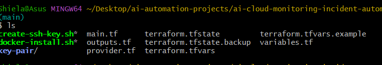

### AWS EC2 with Elastic IP

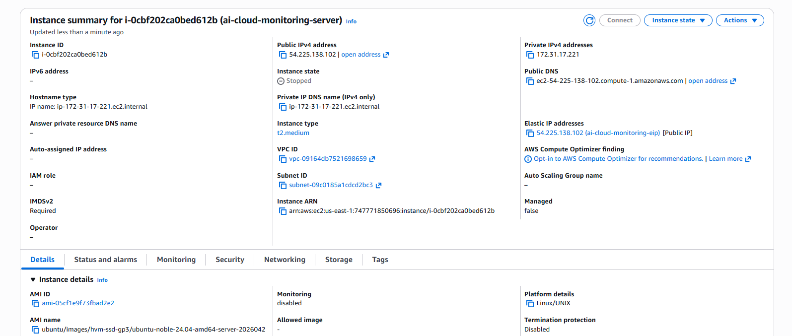

---

## Monitoring

### Docker Containers

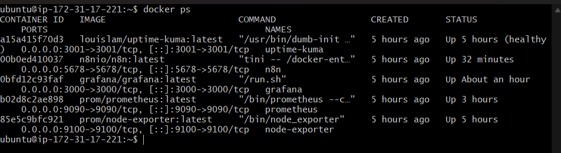

### Prometheus Targets

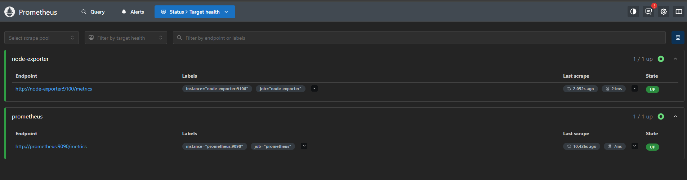

### Grafana Dashboard

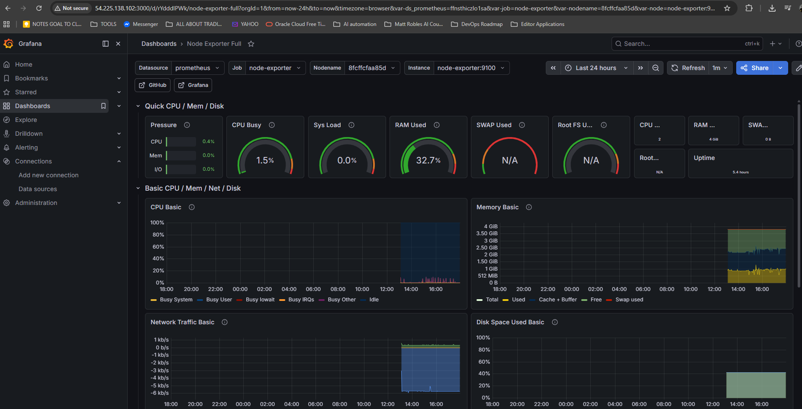

### Uptime Kuma

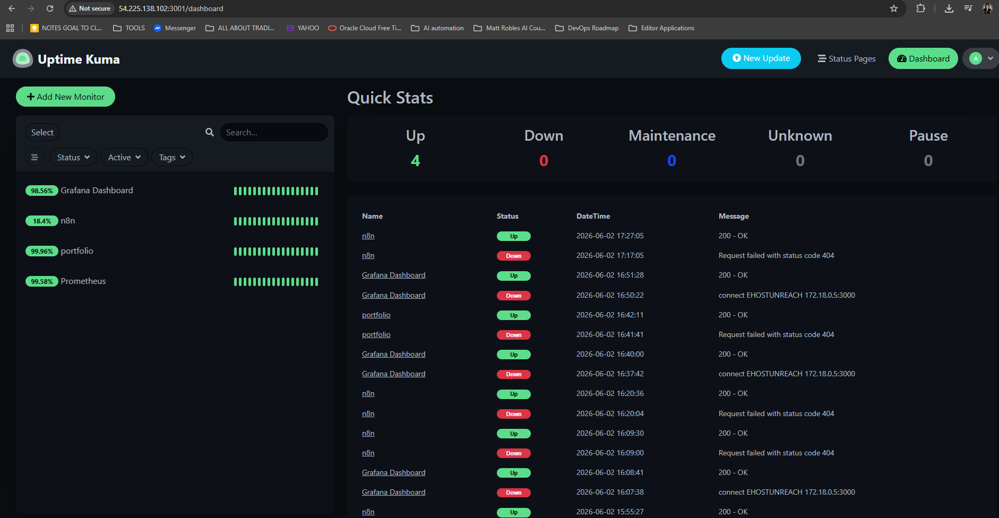

---

## Automation

### n8n Workflow

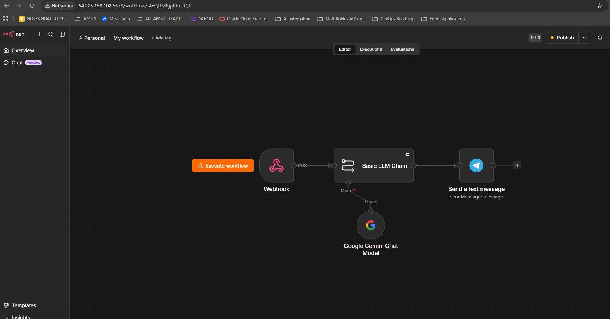

### Webhook Execution

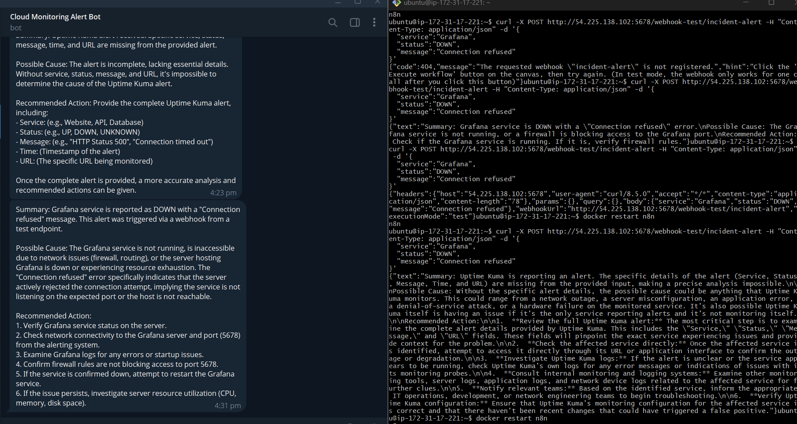

### Telegram Notification

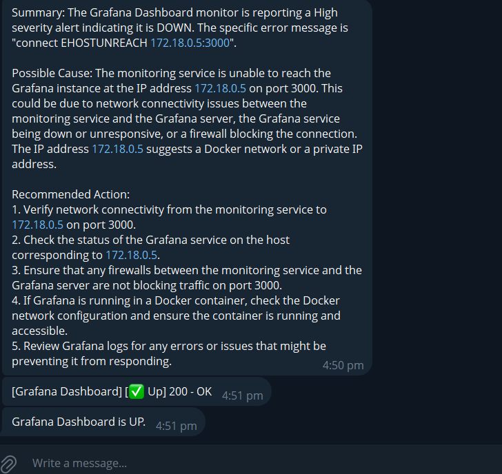
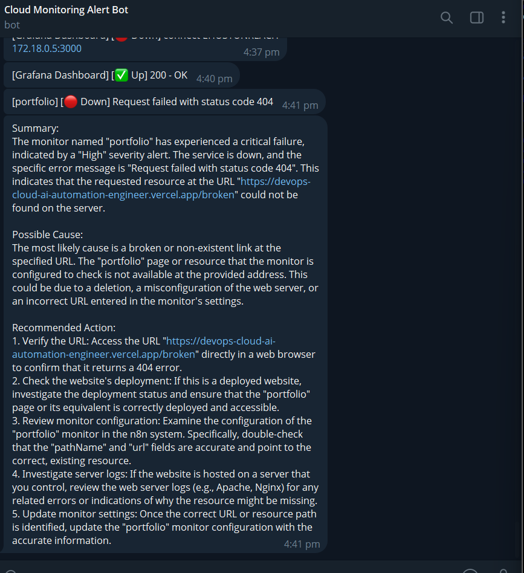

---

## Incident Simulation

### Service Down Detection

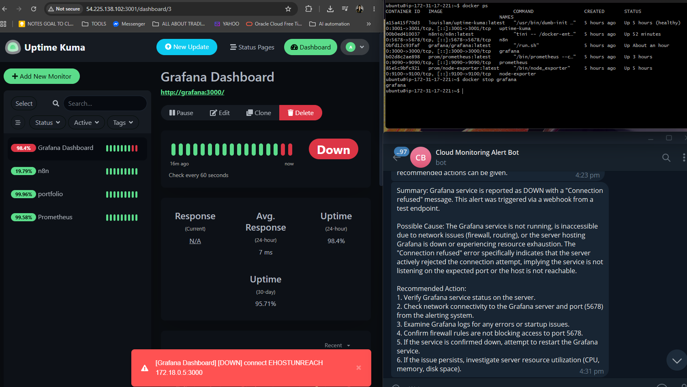

---

# Challenges Encountered

This project involved several real-world troubleshooting scenarios.

### n8n Secure Cookie Configuration Issue

**Issue**

Unable to access n8n properly.

**Resolution**

Adjusted n8n configuration and restarted containers.

---

### Webhook 404 Errors

**Issue**

Webhook endpoint returned 404.

**Resolution**

Activated workflow before testing production webhooks.

---

### OpenAI API Quota Limitations

**Issue**

AI requests failed due to insufficient credits.

**Resolution**

Implemented Gemini API as an alternative.

---

### Invalid JSON Body Errors

**Issue**

HTTP Request node rejected payloads.

**Resolution**

Validated JSON formatting and payload structure.

---

### Docker Service Restart Issues

**Issue**

Monitoring services failed after restart.

**Resolution**

Verified logs and container health checks.

---

Detailed troubleshooting steps can be found in:

```text
docs/troubleshooting.md
```

---

# Skills Demonstrated

## Cloud Engineering

* AWS EC2
* Elastic IP Management
* Infrastructure Deployment

## Infrastructure as Code

* Terraform
* Resource Provisioning
* Configuration Management

## DevOps

* Docker
* Docker Compose
* Linux Administration

## Monitoring & Observability

* Prometheus
* Grafana
* Uptime Kuma
* Node Exporter

## Automation

* n8n
* Webhooks
* API Integrations

## AI Operations (AIOps)

* AI Incident Summarization
* Automated Alert Enrichment
* Operational Automation

---

# Repository Structure

```text
ai-cloud-monitoring-incident-automation/
│
├── terraform/
│   ├── provider.tf
│   ├── main.tf
│   ├── variables.tf
│   ├── outputs.tf
│   ├── create-ssh-key.sh
│   └── docker-install.sh
│
├── prometheus/
│   └── prometheus.yml
│
├── grafana/
│   └── dashboards/
│
├── n8n/
│   ├── README.md
│   └── incident-alert-workflow.json
│
├── docs/
│   ├── architecture.md
│   ├── setup-guide.md
│   ├── troubleshooting.md
│   ├── incident-demo.md
│   ├── screenshots.md
│   └── screenshots/
│
├── docker-compose.yml
│
└── README.md
```

---

# Future Enhancements

Planned improvements:

* Slack notifications
* Microsoft Teams integration
* Grafana alerting
* Loki log aggregation
* Multi-server monitoring
* Auto-remediation workflows
* Jira ticket creation
* AI root cause analysis

---

# Learning Outcomes

Through this project I gained hands-on experience with:

* Infrastructure as Code using Terraform
* AWS cloud deployment
* Dockerized monitoring stacks
* Observability tooling
* Workflow automation
* API integrations
* Incident response automation
* AI-assisted operations (AIOps)

---

# Author

**Shiela Rose Marilao**

DevOps Engineer | Cloud Engineer | AI Automation Builder

GitHub:
https://github.com/faithntech

Portfolio:
https://devops-cloud-ai-automation-engineer.vercel.app
